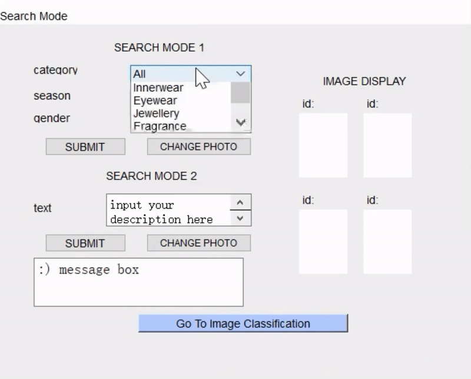
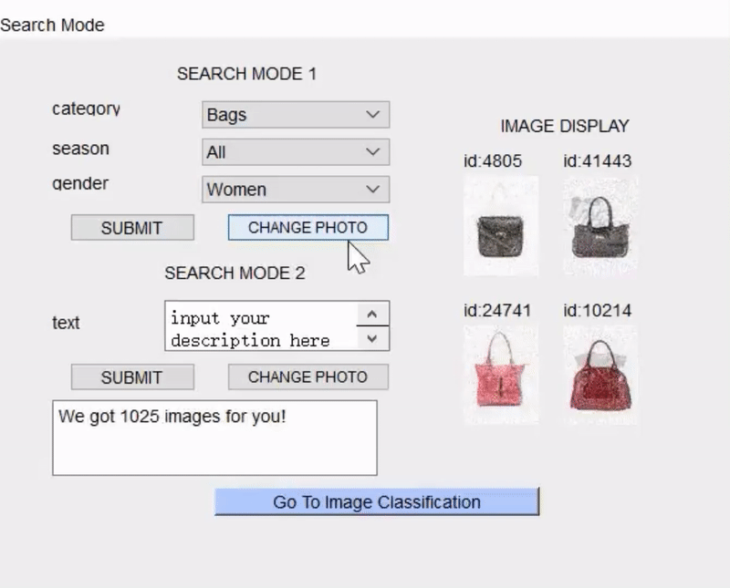
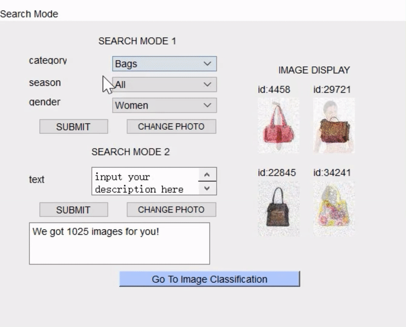
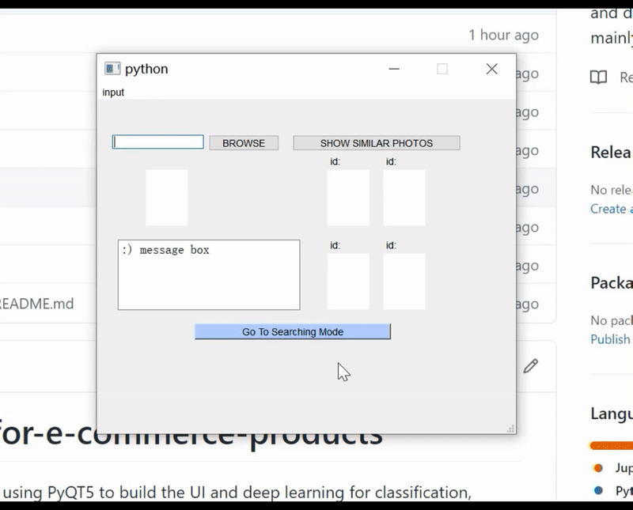

# An-image-repository-for-e-commerce-products
an image repository for  e-commerce products using PyQT5 to build the UI and deep learning for classification, mainly for searching use.

There are two kinds of uses:
1. given the input (categorical data or text description), search for the images in the repository. 
2. given a new image, classify it to the corresponding category, and find similar products in the same category. 

## data
The data is from [this Kaggle challenge](https://www.kaggle.com/c/uw-cs480-fall20). This Kaggle project is to classify e-commerce products into 27 categories. The data includes categorical features, a noisy text description and a noisy image for each product. 

I have implemented the Kaggle project [here](https://github.com/aaazyq/kaggle-Ecommerce_classification) to achive a prediction accuracy over 98%.  In this project I used the classifying model I have built before. 

The **image repository** is the training images (21075 pieces). For each image, it has some features, such as category, gender, season, color etc. 

## Implementation

I built the User Interface using PyQT5 (with assistance of QT Designer). The code is in ./UI-code. 
To run the project, simply run 
```
python code.py
```

## Task 1: Searching Mode

Search By Choosing Categories, Season and Gender 




Change Displaying Photos By Clicking the Button 



Search By Inputting Text Description (there is no specific limit for the input text, but it is better to limit it less than 20 words)

It used LSTM to obtain the classifying category. For the training process, please see the training/firststage_text_lstm.ipynb  



## Task 2: Classification Mode

Browse an image and classify the category 

The default size is 60\*80. If the image is too large, please resize the image to a smaller size. 

It used CNN (ResNet18) to obtain the classifying category. For the training process, please see the training/firststage_image_resnet.ipynb



Show similar photos in the same cateogories 

 
